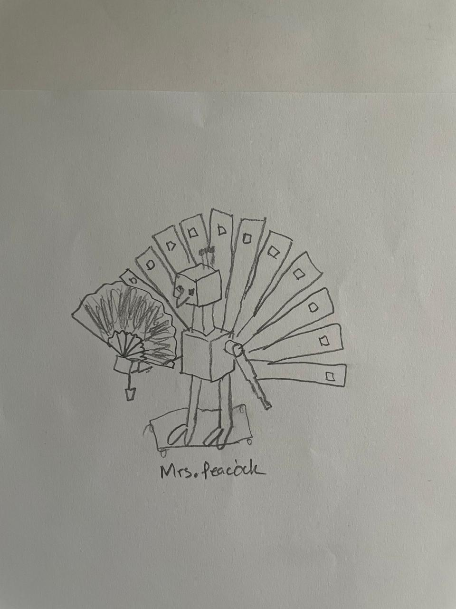

# Journal: Ahsen and Pranav
## 17 September 2024 (edited on 18th)

### Initial Thoughts
For this play, above all else, I want to create a memorable character. One that, by the end of the play, teh audience will leave with a clear. complete picture off. With the play runtime being 20 minutes, each character will get roughly two and a half minutes to speak and establish their character. Given the limitation, as well as the inherent clunkiness of having robot actors, my robot will have to have an extreme personality and voice to grab the audience's attention. While subtle nuances in character development is always appreciated in theatre, our compact play is perhaps not the best venue for that.

### Character
We chose Mrs.Peacock.
“Character description (Open for change) - Mrs. Peacock is the wife of an unidentified Senator. She has been taking bribes for an undisclosed amount of time, though she winds up paying some of that money to Mr. Boddy, who discovered her secret thanks to the cook they share. She murders said cook in two of the versions, and in one, she murders every single person because that’s what vindictive old women who think they’re better than everyone else do.

Quality Of Character: It’s all about the sighs with Mrs. Peacock, as handled by Eileen Brennan. She’s great at expressing disapproval without using real words to do it. She’s of that not rare enough breed who thinks her own sins are completely legitimate but those of others are immoral, offensive and scuzzy. This leads to some pretty defensive comments about her own bribe-taking and some pretty offensive statements and mean-spirited looks about things like homosexuality, prostitution and murder.”
[source](https://www.cinemablend.com/new/Every-Single-Character-Clue-Ordered-By-Greatness-40549.html)

### Sketch
